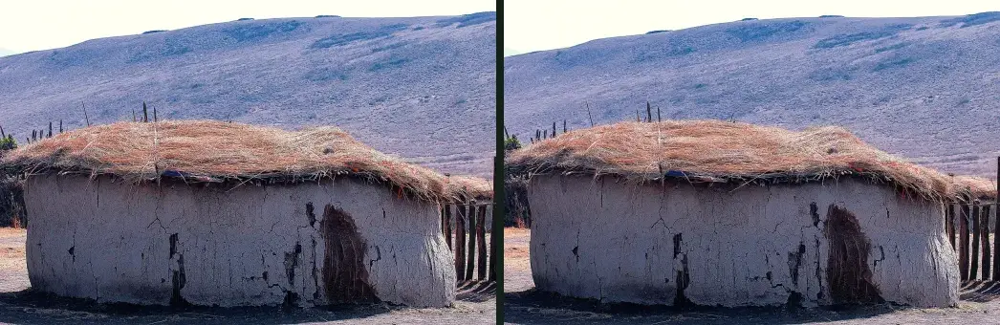
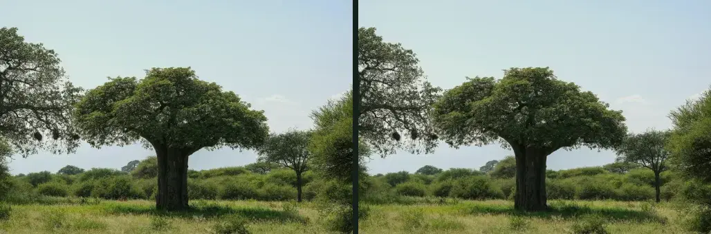
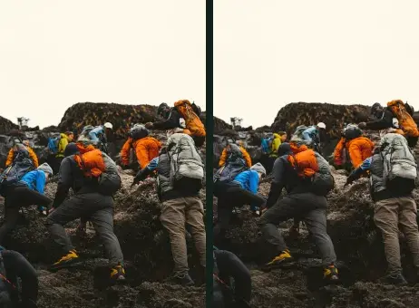
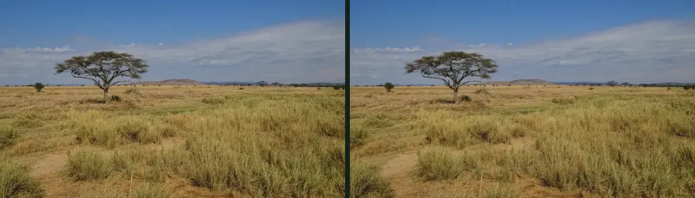
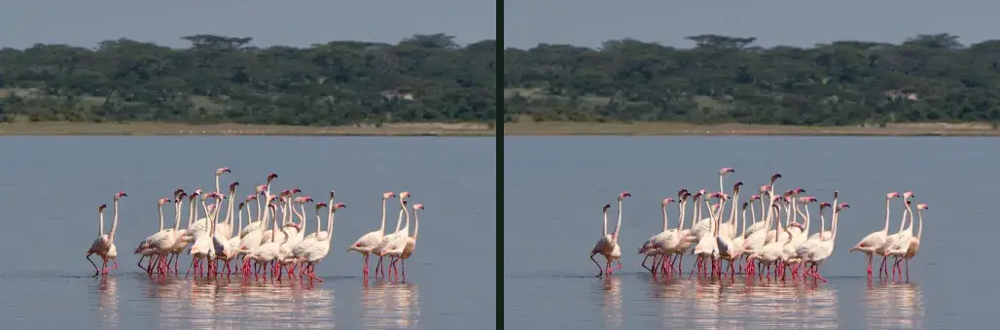
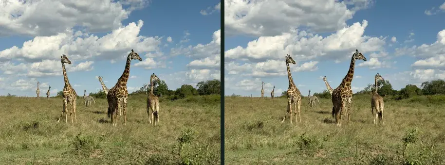
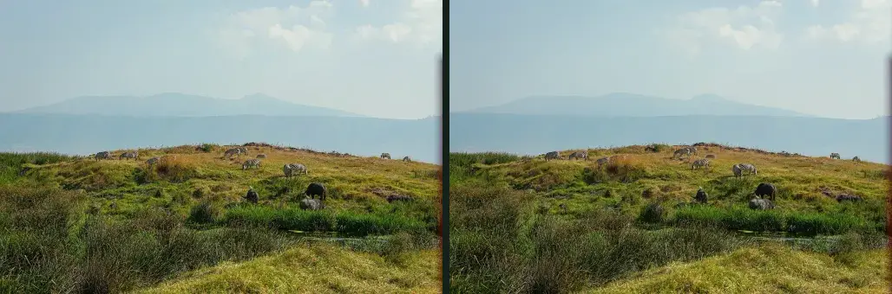

# Armonización tonal — qué se ha ajustado y por qué

Generado por `node scripts/harmonize-photos.mjs`. Complementa
`docs/homepage-image-tone-audit.md`, que es quien mide y quien decide qué
fotografía se sale de la dirección fotográfica.

**Ninguna fotografía original se ha modificado.** Los originales del cliente
siguen intactos en `public/images/maisha-quest/originals/`; lo que cambia es
el derivado web, que se regenera desde el original cada vez que se ejecuta esto.

Los ajustes son de color y solo de color: temperatura, saturación, negros y
altas luces. No se ha recortado, ni retocado, ni añadido o quitado nada, ni se
ha cambiado el color real de ningún animal. Los atardeceres cálidos del cliente
NO se tocan: son cálidos porque son atardeceres, y esa es la dirección buscada.

Fecha de esta pasada: 2026-08-29.

| Fotografía | Por qué | Fuente | Temperatura | Saturación | Altas luces |
| --- | --- | --- | ---: | ---: | ---: |
| `tanzania/maasai-boma` | 11.579 K: con diferencia la más fría de la portada, azul de sombra abierta en mitad de un carrusel cálido. | original de Commons | 8591 → 8601 K | 25 % → 25 % | 8 % → 8 % |
| `tanzania/tarangire-baobab` | 38 % de altas luces: el cielo se va a blanco en una banda a sangre de 1440 px, y encima lleva texto. | original de Commons | 6101 → 6116 K | 26 % → 26 % | 13 % → 13 % |
| `tanzania/kilimanjaro-climbers` | 13 % de saturación: es la más apagada y fría de la portada. Sus altas luces (36 %) NO se tocan: son el glaciar, y comprimirlas grisearía la nieve, que es justo lo que el encargo prohíbe. | original de Commons | 5411 → 5410 K | 21 % → 21 % | 36 % → 36 % |
| `tanzania/serengeti-plains` | 51 % de saturación: verdes y cielo por encima del resto de la portada. | original de Commons | 5357 → 5365 K | 45 % → 45 % | 0 % → 0 % |
| `maisha-quest/flamingos-tanzania-lake` | 9.128 K: el agua del lago se va al cian y es la foto más fría de la portada después de la boma. El rosa de los flamencos no se toca. | original del cliente (image-X4-1.jpg) | 7417 → 7428 K | 18 % → 18 % | 1 % → 1 % |
| `maisha-quest/giraffes-open-savannah` | 6.438 K: entra nueva en la portada —sustituye a la monocroma— y llega un punto más fría que el resto. Ajuste mínimo: el cielo sigue siendo azul y la hierba, hierba. | original del cliente (image-X4-3.jpg) | 5910 → 5918 K | 30 % → 30 % | 4 % → 4 % |
| `tanzania/ngorongoro-zebras` | 6.719 K con verdes fríos: se aparta del oliva del resto. | original de Commons | 5925 → 5931 K | 34 % → 34 % | 2 % → 2 % |

## Recetas exactas

| Fotografía | Saturación | Ganancia R/G/B | Pedestal R/G/B |
| --- | ---: | --- | --- |
| `tanzania/maasai-boma` | 0.9 | 1.02 / 1 / 0.955 | 3 / 3 / 1 |
| `tanzania/tarangire-baobab` | 0.97 | 0.93 / 0.905 / 0.865 | 8 / 9 / 4 |
| `tanzania/kilimanjaro-climbers` | 1.12 | 0.99 / 0.965 / 0.92 | 4 / 5 / 1 |
| `tanzania/serengeti-plains` | 0.88 | 1.03 / 0.99 / 0.94 | 6 / 6 / 2 |
| `maisha-quest/flamingos-tanzania-lake` | 1.04 | 1.03 / 1.005 / 0.945 | 4 / 4 / 1 |
| `maisha-quest/giraffes-open-savannah` | 0.97 | 1.02 / 1 / 0.96 | 3 / 4 / 1 |
| `tanzania/ngorongoro-zebras` | 0.94 | 1.035 / 1 / 0.945 | 5 / 6 / 2 |

La ganancia multiplica cada canal —más rojo y menos azul calienta— y el
pedestal lo desplaza, que pesa en las sombras y casi nada en las luces: negros
levantados con un sesgo oliva. Una ganancia por debajo de 1 con pedestal
positivo comprime las altas luces y recupera detalle en un cielo quemado.

## Comparación antes / después

### `maasai-boma`

### `tarangire-baobab`

### `kilimanjaro-climbers`

### `serengeti-plains`

### `flamingos-tanzania-lake`

### `giraffes-open-savannah`

### `ngorongoro-zebras`

