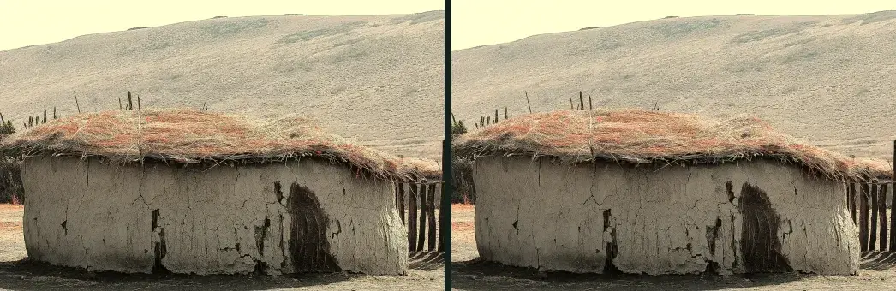
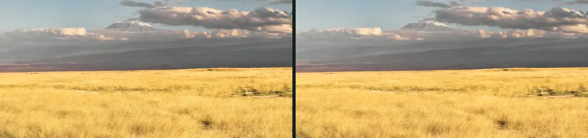
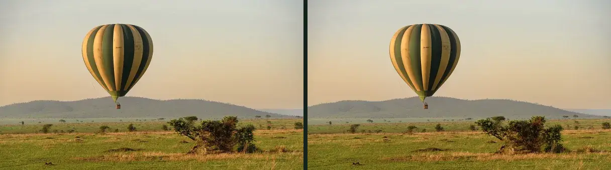
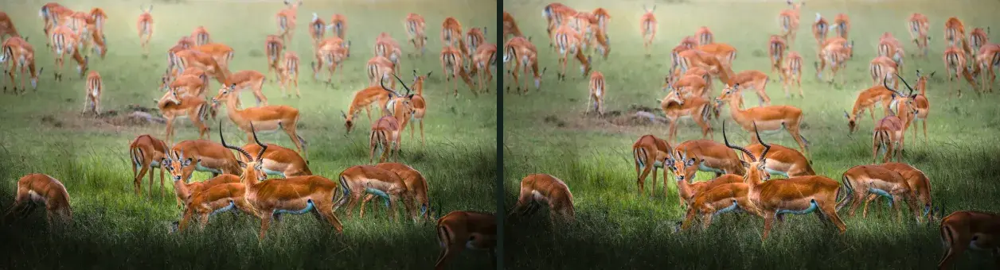

# Armonización tonal — qué se ha ajustado y por qué

Generado por `node scripts/harmonize-photos.mjs`. Complementa
`docs/homepage-image-tone-audit.md`, que es quien mide y quien decide qué
fotografía se sale de la dirección fotográfica.

**Ninguna fotografía original se ha modificado.** Los originales del cliente
siguen intactos en `public/images/maisha-quest/originals/`; lo que cambia es
el derivado web, que se regenera desde el original cada vez que se ejecuta esto.

Los ajustes son de color y solo de color: temperatura, saturación, negros y
altas luces. No se ha recortado, ni retocado, ni añadido o quitado nada, ni se
ha cambiado el color real de ningún animal. Los atardeceres cálidos del cliente
NO se tocan: son cálidos porque son atardeceres, y esa es la dirección buscada.

Fecha de esta pasada: 2026-08-29.

La columna «antes» compara con el derivado que estaba publicado en el momento
de ejecutarlo: si se vuelve a lanzar sin cambiar la receta no hay diferencia,
porque el resultado se regenera siempre desde el mismo original. El número que
motivó cada ajuste es el que aparece en la columna «Por qué», medido sobre la
portada antes de tocar nada.

| Fotografía | Por qué | Fuente | Temperatura | Saturación | Altas luces |
| --- | --- | --- | ---: | ---: | ---: |
| `tanzania/maasai-boma` | 11.579 K: con diferencia la más fría de la portada, azul de sombra abierta en mitad de un carrusel cálido. | original de Commons | 8590 → 8597 K | 25 % → 25 % | 8 % → 8 % |
| `tanzania/tarangire-baobab` | 38 % de altas luces: el cielo se va a blanco en una banda a sangre de 1440 px, y encima lleva texto. | original de Commons | 6103 → 6116 K | 26 % → 26 % | 13 % → 13 % |
| `tanzania/kilimanjaro-climbers` | 13 % de saturación: es la más apagada y fría de la portada. Sus altas luces (36 %) NO se tocan: son el glaciar, y comprimirlas grisearía la nieve, que es justo lo que el encargo prohíbe. | original de Commons | 5410 → 5410 K | 21 % → 21 % | 36 % → 36 % |
| `tanzania/serengeti-plains` | 51 % de saturación: verdes y cielo por encima del resto de la portada. | original de Commons | 5359 → 5366 K | 45 % → 45 % | 0 % → 0 % |
| `tanzania/maasai-boma-warm` | CULTURA. Dominante azul violácea en el tejado, en la pared y en toda la colina, que es lo que el cliente señala en su captura: no pega ni con el oliva del fondo, ni con el dorado de los filetes, ni con las tarjetas de safari que tiene al lado. No hay en el catálogo ninguna otra fotografía de cultura o comunidad con tonos tierra, así que se corrige esta en un derivado aparte, sin tocar el original. | original de Commons | 4919 → 4908 K | 24 % → 24 % | 8 % → 8 % |
| `tanzania/kilimanjaro-kibo` | KILIMANJARO. Sustituye a los escaladores, cuyas chaquetas turquesa y naranja se comían la tarjeta. Esta ya estaba en el catálogo y tiene la montaña, la hierba dorada y ningún color de ropa; le sobraban el amarillo ácido de la hierba y una banda de bruma violeta. | original de Commons | 4171 → 4154 K | 33 % → 33 % | 1 % → 1 % |
| `tanzania/balloon-serengeti` | LUJO. Cielo gris azulado y luz plana: era la tarjeta más apagada de las ocho y no acompañaba a las demás. | original de Commons | 4574 → 4570 K | 34 % → 34 % | 0 % → 0 % |
| `maisha-quest/antelope-herd-grasslands` | AVENTURA. Verde de hierba fresca, más frío y más eléctrico que el oliva del resto de la colección. | original del cliente (image-X4.jpg) | 4550 → 4550 K | 37 % → 36 % | 0 % → 0 % |
| `maisha-quest/flamingos-tanzania-lake` | 9.128 K: el agua del lago se va al cian y es la foto más fría de la portada después de la boma. El rosa de los flamencos no se toca. | original del cliente (image-X4-1.jpg) | 6043 → 6541 K | 10 % → 13 % | 1 % → 1 % |
| `maisha-quest/giraffes-open-savannah` | 6.438 K: entra nueva en la portada —sustituye a la monocroma— y llega un punto más fría que el resto. Ajuste mínimo: el cielo sigue siendo azul y la hierba, hierba. | original del cliente (image-X4-3.jpg) | 5910 → 5918 K | 30 % → 30 % | 4 % → 4 % |
| `tanzania/ngorongoro-zebras` | SAFARI Y ZANZÍBAR. 6.719 K con verdes fríos: se apartaba del oliva del resto, y en el recorte de la tarjeta la bruma azul del cráter ocupa el tercio superior. | original de Commons | 5335 → 5333 K | 29 % → 29 % | 19 % → 19 % |

## Recetas exactas

| Fotografía | Saturación | Ganancia R/G/B | Pedestal R/G/B |
| --- | ---: | --- | --- |
| `tanzania/maasai-boma` | 0.9 | 1.02 / 1 / 0.955 | 3 / 3 / 1 |
| `tanzania/tarangire-baobab` | 0.97 | 0.93 / 0.905 / 0.865 | 8 / 9 / 4 |
| `tanzania/kilimanjaro-climbers` | 1.12 | 0.99 / 0.965 / 0.92 | 4 / 5 / 1 |
| `tanzania/serengeti-plains` | 0.88 | 1.03 / 0.99 / 0.94 | 6 / 6 / 2 |
| `tanzania/maasai-boma-warm` | 0.9 | 1.13 / 1.045 / 0.86 | 0 / -1 / -6 |
| `tanzania/kilimanjaro-kibo` | 1 | 1 / 0.99 / 0.96 | 6 / 6 / 3 |
| `tanzania/balloon-serengeti` | 1.06 | 1.035 / 1.005 / 0.95 | 4 / 5 / 1 |
| `maisha-quest/antelope-herd-grasslands` | 1 | 1.035 / 1 / 0.94 | 4 / 5 / 2 |
| `maisha-quest/flamingos-tanzania-lake` | 1.16 | 1.05 / 1.01 / 0.93 | 4 / 4 / 0 |
| `maisha-quest/giraffes-open-savannah` | 0.97 | 1.02 / 1 / 0.96 | 3 / 4 / 1 |
| `tanzania/ngorongoro-zebras` | 0.96 | 1.045 / 1.005 / 0.93 | 5 / 6 / 2 |

La ganancia multiplica cada canal —más rojo y menos azul calienta— y el
pedestal lo desplaza, que pesa en las sombras y casi nada en las luces: negros
levantados con un sesgo oliva. Una ganancia por debajo de 1 con pedestal
positivo comprime las altas luces y recupera detalle en un cielo quemado.

## Comparación antes / después

### `maasai-boma`

### `tarangire-baobab`

### `kilimanjaro-climbers`

### `serengeti-plains`

### `maasai-boma-warm`

### `kilimanjaro-kibo`

### `balloon-serengeti`

### `antelope-herd-grasslands`

### `flamingos-tanzania-lake`

### `giraffes-open-savannah`

### `ngorongoro-zebras`

