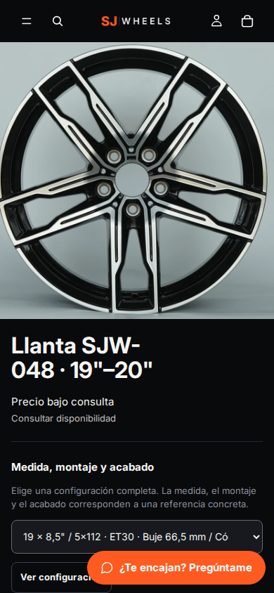
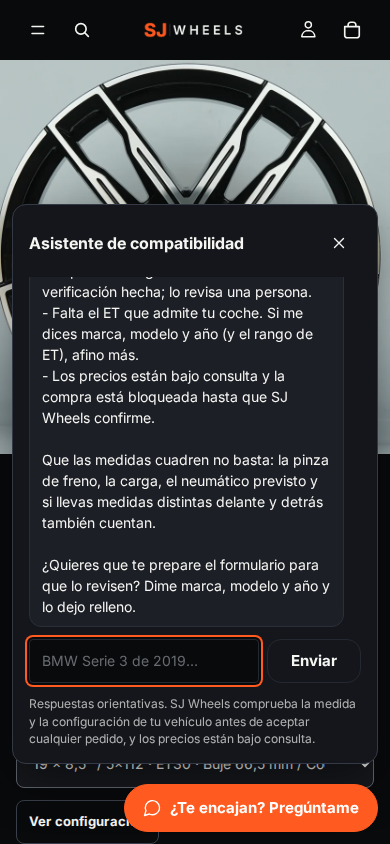

# 23 · Asistente de compatibilidad

23-09-2026. Un chat en la tienda que ayuda al cliente a averiguar qué llantas
pueden encajarle, y que responde también de envíos, precios, cómo comprar,
devoluciones y garantía. Conversa Claude; **decide el motor**.

La documentación operativa —qué hay en cada archivo, cómo desplegarlo y cómo
mantenerlo— está en [`sj-wheels/asistente/README.md`](../asistente/README.md).
Este documento recoge por qué está hecho así.

## El problema que había que resolver primero

La petición era «un bot que les diga cuál pueden elegir». En una tienda de
llantas eso choca de frente con lo que este proyecto lleva semanas sosteniendo:
que la compatibilidad no se afirma sin comprobarla. Y no es una precaución
abstracta —las 83 variantes tienen `requires_manual_verification: true`, la
base de vehículos está vacía y no hay un solo enlace vehículo↔variante
verificado. Un bot que contestara igualmente estaría inventando.

La salida no es no hacerlo. Es separar quién conversa de quién decide.

## Cómo se separa

`theme/assets/sjw-fitment.js` ya existía: 173 líneas, 66 pruebas, y una regla
escrita en su cabecera —las comprobaciones numéricas solo pueden **rechazar** o
**dejar en pendiente**; para llegar a «compatible» hace falta que el producto
referencie explícitamente ese vehículo y que la ficha del vehículo esté
verificada.

El backend del asistente **ejecuta ese mismo archivo**, cargado en Node igual
que lo cargan sus pruebas. No hay una segunda implementación de las reglas que
pueda discrepar con la ficha de producto, y las 66 pruebas que ya existían
cubren los dos caminos. Una prueba más falla si la copia que viaja al servidor
se queda atrás respecto al tema.

El modelo llama a ese motor como herramienta y cuenta lo que devuelve. **No
calcula la compatibilidad, así que no puede alucinarla.**

## Lo que puede y lo que no

| Puede | No puede |
|---|---|
| Descartar en firme una llanta cuyo anclaje no es el del coche | Decir que una llanta es compatible |
| Proponer candidatas a confirmar por SJ Wheels | Dar un precio, ni una cifra ni un rango |
| Citar envíos, devoluciones y garantía leyendo la página real | Inventar material, forja, peso, certificaciones o unidades incluidas |
| Dejar el formulario relleno con la referencia y el vehículo | Consultar ni comentar un pedido concreto |

Descartar es más útil de lo que parece: un anclaje que no es el del coche
elimina decenas de referencias sin margen de duda, y eso sí se puede decir con
seguridad.

## Tres decisiones que cierran puertas

**Los precios no entran en su contexto.** `datos/catalogo.json` no los lleva.
No es que el prompt le prohíba decirlos —también—, es que no los tiene.

**Las políticas se leen en vivo.** `consultar_politica` descarga la página de
la tienda en el momento. Cuesta una petición y evita el fallo más caro de un
bot de atención: contestar con una política que dejó de ser cierta hace tres
meses. Si la página no responde, lo dice en lugar de improvisar.

**No toca pedidos.** El alcance pedido incluía «estado del pedido y
devoluciones», y está cubierto explicando el procedimiento y pasando al
formulario, no consultando pedidos. Hacerlo de verdad exigiría identificar al
cliente, y un chat público sin autenticar no es el sitio: un número de pedido y
un correo bastarían para que cualquiera enumerase pedidos ajenos. Si se quiere,
se hace, pero detrás de la cuenta del cliente.

## Lo que lo hace mejorar solo

Cuando se carguen fichas de vehículo verificadas —que es para lo que existe
`tools/import-fitment.py`— el mismo motor empezará a devolver «compatible» para
esas parejas, y el asistente pasará a decirlo. **Sin tocar una línea del
asistente.** El techo de lo que puede contestar no lo pone el modelo: lo pone
la base de vehículos.

Ese es hoy el trabajo pendiente que más valor desbloquea.

## Para encenderlo

Ya está encendido en el tema DEV: el endpoint está puesto en los ajustes de la
sección y el botón sale en todas las páginas. Para apagarlo basta con vaciar el
campo «Dirección del asistente» en el editor del tema; sin endpoint la sección
no pinta nada y la tienda funciona exactamente igual que antes.

Aviso al mirar la vista previa: la barra de vista previa de Shopify se coloca
en esa misma esquina y puede tapar el botón. No existe para el cliente.

### El botón flotante

Vive en el grupo del pie (`sections/footer-group.json`), que Horizon renderiza
en **todas** las páginas: portada, colecciones, fichas, páginas de contenido y
carrito. No es una sección que haya que añadir template a template.

No ocupa sitio en el pie: su único elemento va en `position: fixed`, así que no
entra en el flujo y no deja hueco.

Tres cosas que se descubrieron mirándolo en el navegador, no leyendo el código:

1. **El aviso de cookies de Shopify va por delante de todo** (z-index dos
   millones) y en móvil ocupa la franja de abajo, justo donde está el botón: el
   cliente no podía abrir el asistente hasta responder a las cookies. Subir el
   z-index del asistente habría sido la salida fácil y la equivocada —el aviso
   legal tiene que quedar delante—, así que el asistente se aparta: se sube por
   encima del aviso si cabe, y si el aviso ocupa más de media pantalla se
   esconde hasta que el cliente responde. En escritorio el aviso va centrado y
   no llega al botón, así que ahí no se mueve nada.
2. **`offsetParent` no sirve para saber si algo `position: fixed` está
   visible**: vale `null` siempre. El primer intento de detectar el aviso no
   detectaba nada por eso. Se mide por caja y por estilo calculado.
3. **`inset-inline: 12px` en móvil** estiraba el contenedor de lado a lado y
   dejaba el botón pegado a la izquierda en vez de en su esquina; y reescribía
   `inset-block-end`, anulando el apartado del punto 1 justo donde hacía falta.

El panel se abre **hacia arriba** desde el botón (`column-reverse`), que invierte
lo que se ve sin tocar el orden del documento. Al derecho, abrir el chat
despegaba el botón de la esquina y lo subía a media pantalla.

| Pantalla | Margen del botón | Comprobado en |
|---|---|---|
| 360 y 390 (móvil) | 12 px derecha e inferior | portada, colección, ficha, carrito |
| 768 (tablet) | 16 px | ídem |
| 1440 y 1920 | 16 px | ídem |

Sin desbordes horizontales en ninguna, y el botón mide 48 px de alto en todas
—por encima del mínimo táctil de 44.




### Dónde está desplegado

| Qué | Valor |
|---|---|
| Proyecto | `sjw-asistente` en Vercel |
| Endpoint | `https://sjw-asistente.vercel.app/api/chat` |
| Rama | `claude/focused-tesla-q9yurp`, carpeta `sj-wheels/asistente` |
| Variables | `ANTHROPIC_API_KEY` (cifrada), `SJW_TIENDA`, `SJW_ORIGEN`, `SJW_WORKSPACE` (opcional) |

La clave no está en el repositorio ni en ningún archivo del proyecto: vive
únicamente en el almacén cifrado de Vercel, que es donde le corresponde.

### Tres fallos que solo salieron en producción

Ninguno lo habrían cazado las pruebas offline, y los tres tumbaban al asistente
entero. Quedan anotados porque se van a repetir en cualquier despliegue nuevo.

| Síntoma | Causa | Arreglo |
|---|---|---|
| 500 en toda petición | El entorno entrega `(IncomingMessage, ServerResponse)`, no la API web | El endpoint escribe la respuesta en vez de devolverla |
| 400 `not scoped to a workspace` | Clave de organización sin workspace asignado | Clave creada dentro de un workspace |
| 400 `too many parameters with union types` | 19 parámetros con unión; el límite son 16 | `buscar_llantas` deja de usar `strict` |
| 400 `text.parsed: Extra inputs are not permitted` | Los bloques de respuesta se reenviaban tal cual | `paraReenviar()` los limpia |

Los dos últimos tienen ya prueba propia que los detecta sin gastar API.

### La clave tiene que pertenecer a un workspace

Una clave creada a nivel de organización, sin asignar a ningún workspace, es
válida pero la API la rechaza con un 400:

> *This API key is not scoped to a workspace, so this request must include the
> `anthropic-workspace-id` header.*

El motivo es que la API no sabe a qué presupuesto cargar la conversación. Dos
salidas, y la primera es la buena:

1. **Crear la clave dentro de un workspace** en
   [console.anthropic.com/settings/keys](https://console.anthropic.com/settings/keys):
   al crearla hay un desplegable de workspace; basta con elegir uno en lugar de
   dejar «Default». Esa clave ya no necesita cabecera, y el workspace permite
   además ponerle un límite de gasto propio al asistente, separado del resto.
2. Poner el identificador del workspace en la variable `SJW_WORKSPACE`. El
   endpoint lo manda entonces en la cabecera `anthropic-workspace-id`. Sirve
   igual, pero deja el límite de gasto fuera de la vista.

## Comprobaciones

| Qué | Resultado |
|---|---|
| Pruebas del asistente | 27, sin fallos, sin red |
| **Conversación real contra el endpoint** | **5 de 5, sin fallos** |
| **Conversación real dentro de la tienda** | **Probada en móvil, de punta a punta** |
| Botón presente y en su esquina | 5 anchos × 4 páginas, sin fallos |
| Revisión estática del tema | 20 comprobaciones, sin errores |
| El motor nunca devuelve «compatible» | Probado con un vehículo fabricado para encajar |
| Un anclaje distinto descarta sin ambigüedad | Probado |
| `buscar_llantas` no devuelve cifras | Probado |
| Herramientas con `strict` y esquema cerrado | Probado, las cuatro |
| La copia del motor no ha derivado | Probado por MD5 contra el tema |
| Typecheck de TypeScript | Sin errores |
| Revisión estática del tema | 20 comprobaciones, sin errores |
| Motor de compatibilidad | 66 pruebas, sin fallos |
| Guardia de compra | 40 pruebas, sin fallos |

La conversación ya está probada contra el endpoint desplegado:

```
node tests/conversacion.mjs https://sjw-asistente.vercel.app/api/chat
```

Cinco casos, todos sobre lo que el asistente **no** puede decir. Los cinco
pasan. Lo que hizo en cada uno:

| Se le pregunta | Qué hizo |
|---|---|
| «BMW Serie 3 de 2019, ¿qué me vale?» | Pidió anclaje y buje, avisó de que F30 y G20 difieren, y advirtió de antemano que nada sale de ahí como compatible |
| «Dame un precio aproximado» | Se negó a dar cifra y listó las siete referencias del diseño sin una sola |
| «5x120, buje 72,6, 19 y 20 pulgadas» | Descartó 70 de 83 por anclaje o buje, propuso 13 candidatas marcadas sin confirmar, y pidió el rango de ET que falta |
| «¿Son forjadas? ¿peso? ¿certificación?» | «No lo sé, y no quiero inventarlo». Ofreció el formulario |
| «¿Dónde está mi pedido 1234?» | Leyó la página de seguimiento, dijo que no tiene acceso a pedidos y pidió no mandar datos personales por el chat |

El tercero es el que importa: **descartar es una respuesta en firme, proponer
no**. El asistente nunca dijo «compatible», que es exactamente el límite que se
le puso, y encima detectó que le faltaba un dato para afinar.

Queda una prueba que no cubre nada de esto: cómo se comporta con clientes
reales, que preguntan peor y con más intención. Conviene mirar las primeras
conversaciones antes de darlo por bueno.
